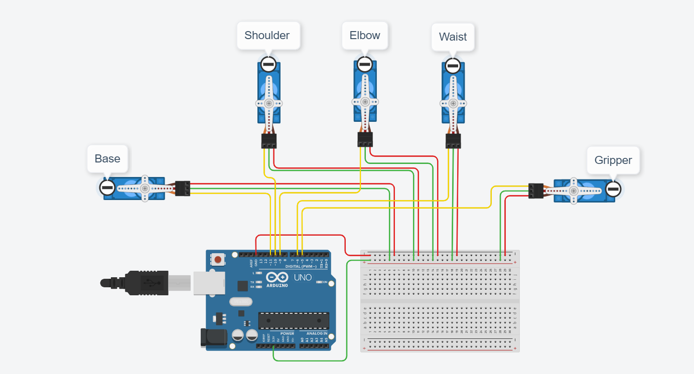

# Design-of-a-Circuit-to-Control-the-Robot-Arm-Motors
Design of a circuit that controls the robot arm servo motors and set them to 90 Degree

This circuit is consists of five servo motors, a breadboard, and Arduino Uno. TINKERCAD was used to connect the motors with the Arduino. In order to enable the Arduino to give non-digital signals (pulse), (11,10,9,6,5) ports were used. The bellow picture shows the circuit produced:

The Arduino was programmed to set all the motors to 90 degrees (Set Motors to 90 Degrees Code.txt) using the blocks feature in TINKERCAD. Set and Rotate servo on pin functions were used. 

